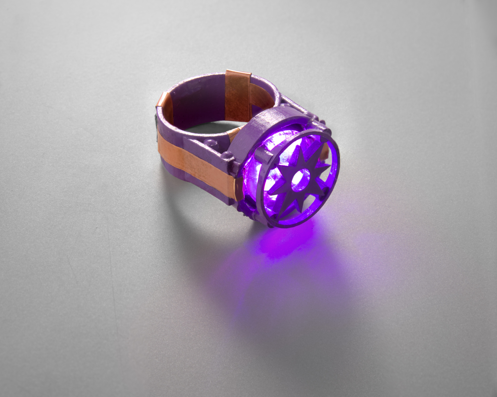
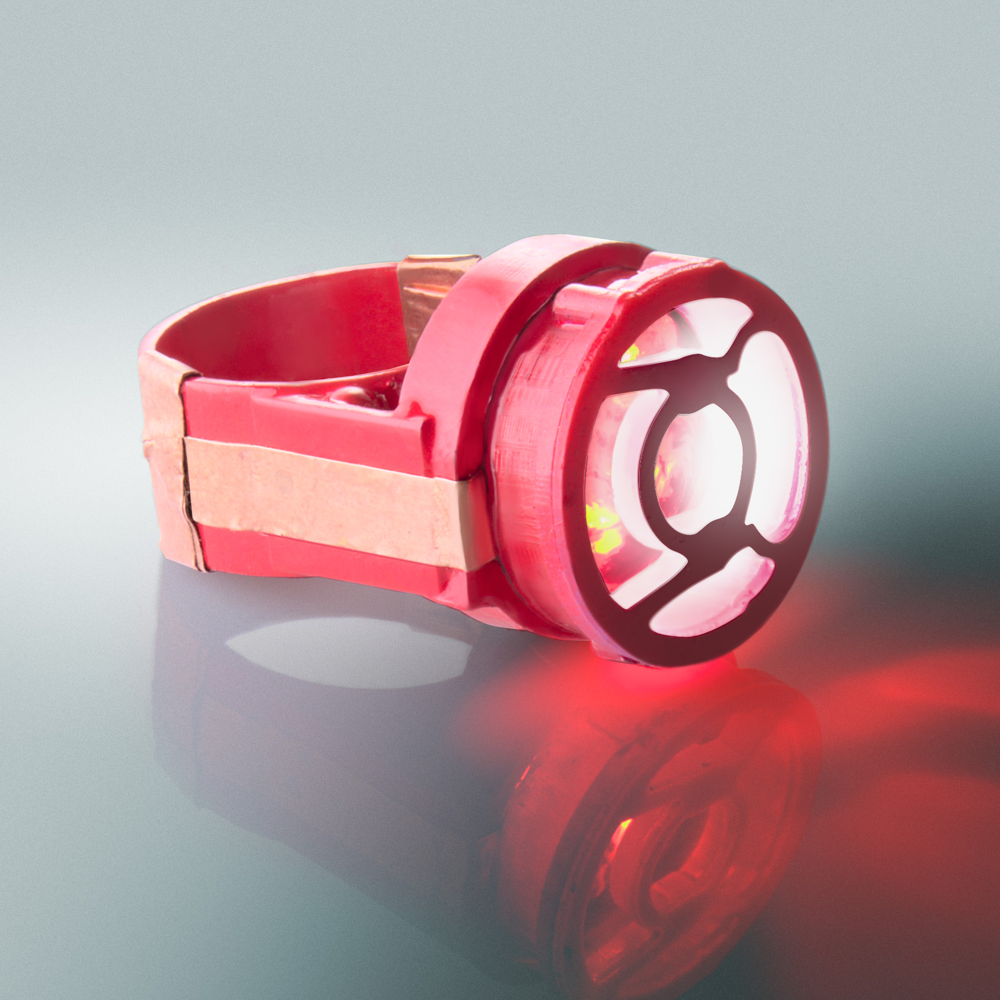

# Lantern Ring

**One ring to rule them all, in the light bind them**

Available on :
- [Tindie](https://www.tindie.com/products/whatnick/lantern-rings/)
- [Etsy](https://www.etsy.com/au/listing/1365896916/lantern-corps-cosplay-ring-with)
- [PCBWay]
- [OSHPark]
- [Aisler](https://aisler.net/p/UOBXJDJP)
- [Shapeway](https://www.shapeways.com/shops/whatnick)
  - [Ring body](https://www.shapeways.com/product/PLQWLUV6V/lantern-ring-body?optionId=251926151&li=shop-inventory)
  - [Green Lantern Logo](https://www.shapeways.com/product/PLQWLUV6V/lantern-ring-body?optionId=251926155&li=shop-inventory)
  - [Yellow Lantern Logo](https://www.shapeways.com/product/87AK6SYQN/yellow-fear-lanterns-logo-from-dc-universe?optionId=253809626&li=shops)
  - [Blue Lantern Logo](https://www.shapeways.com/product/LDGX3RYWW/hope-lanterns-logo-from-dc-universe?optionId=253809602&li=shops)
  - [Indigo Lantern Logo](https://www.shapeways.com/product/RX6YYCM8E/indigo-empathy-logo-from-dc-universe?optionId=253810127&li=shops)
  - [Violet Lantern Logo](https://www.shapeways.com/product/Q4ZM3RG58/purple-love-lanterns-logo?optionId=253810197&li=shops)
  - [Red Lantern Logo](https://www.shapeways.com/product/2T2WC596J/red-rage-lanterns-logo?optionId=253810042&li=shops)
  - [Orange Lantern Logo](https://www.shapeways.com/product/XHF33N3QN/orange-avarice-lanterns-logo?optionId=253810121&li=shops)
  - [Black Lantern Logo](https://www.shapeways.com/product/NEF64B7SB/lantern-ring-life-and-death)
  - [White Lantern Logo](https://www.shapeways.com/product/NEF64B7SB/lantern-ring-life-and-death)
  - [Black MTG Logo](https://www.shapeways.com/product/NJ25J3LPM/magic-the-gathering-black-mana-logo?optionId=253809132)

[LED Colours and quantum physics](https://www.forbes.com/sites/chadorzel/2019/07/01/the-mostly-quantum-physics-of-making-colors/?sh=2ce5846e3953) are inextricably linked.
After watching a temperature based LED colour changing demo at questacon, an idea started forming in my head for using a similar idea with LED's of different colours and seeing how they
react spectrally with temperature.

I have also always been a Green Lantern nerd and I have been making lantern rings since 2010. You will probably find some of them in the wild in Hobart among the clientele of various
pubs and nightclubs. This is a more serious attempt at making a piece of electronic jewellery, cosplay prop and nerdy onanism all rolled into one.

## Licence

[OSHW TAPR](https://tapr.org/the-tapr-open-hardware-license/)
