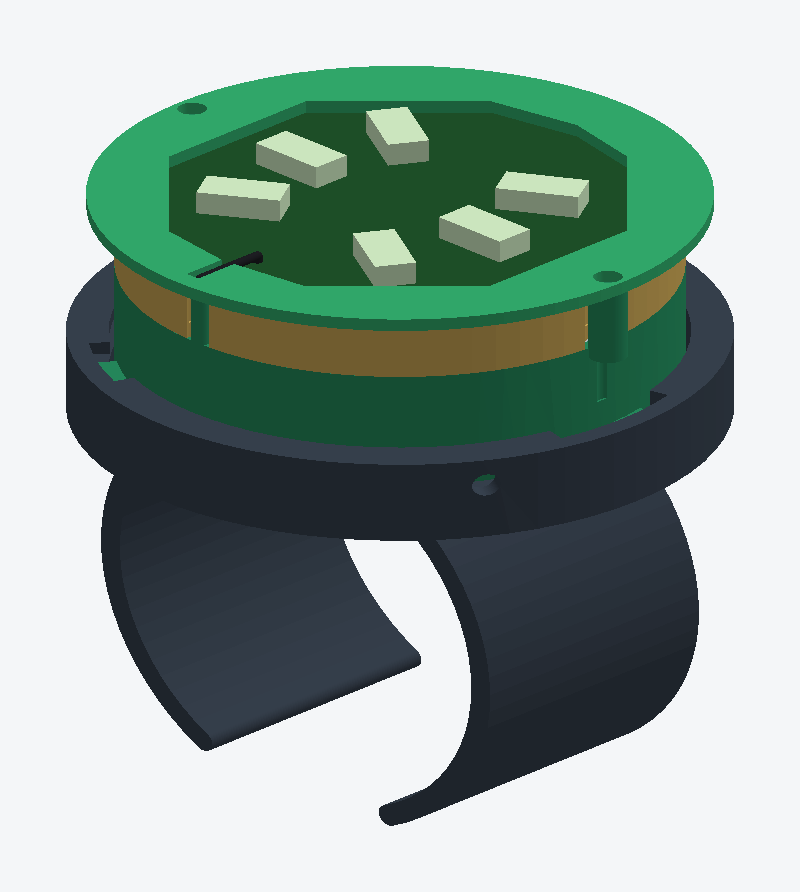
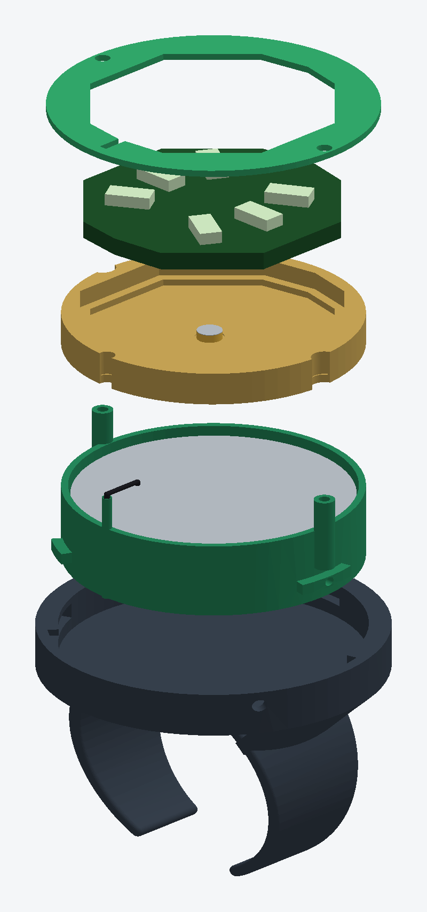
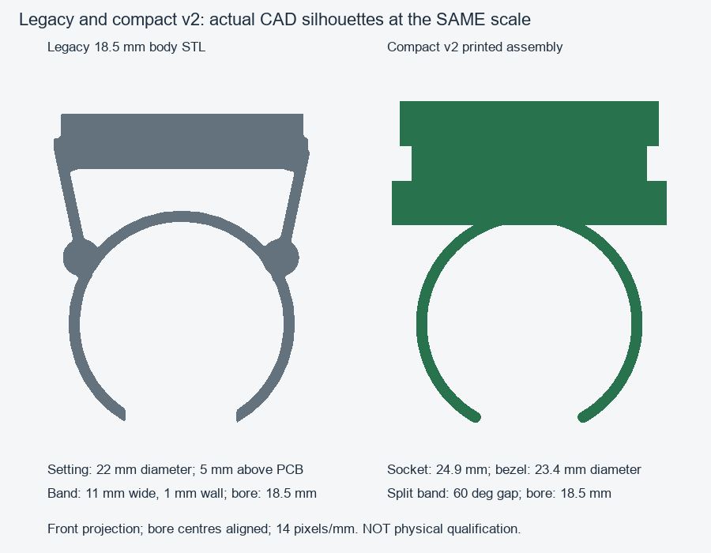
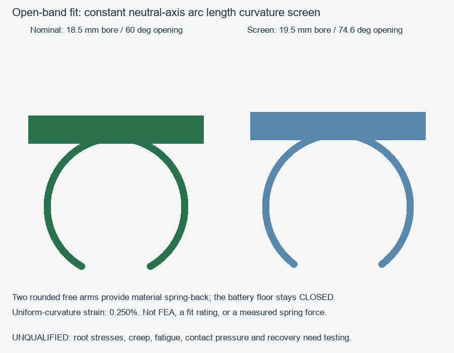
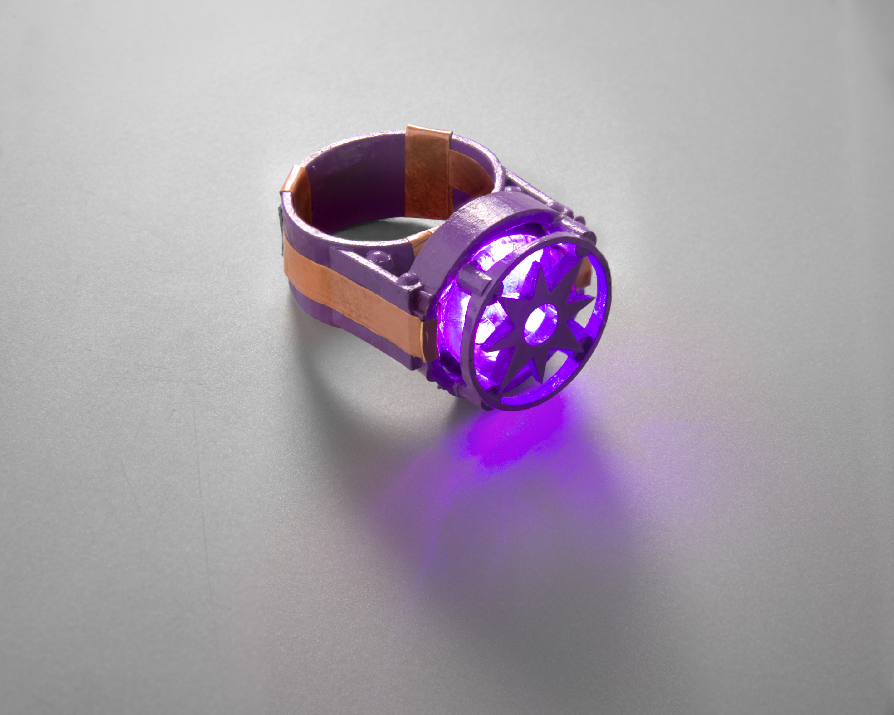
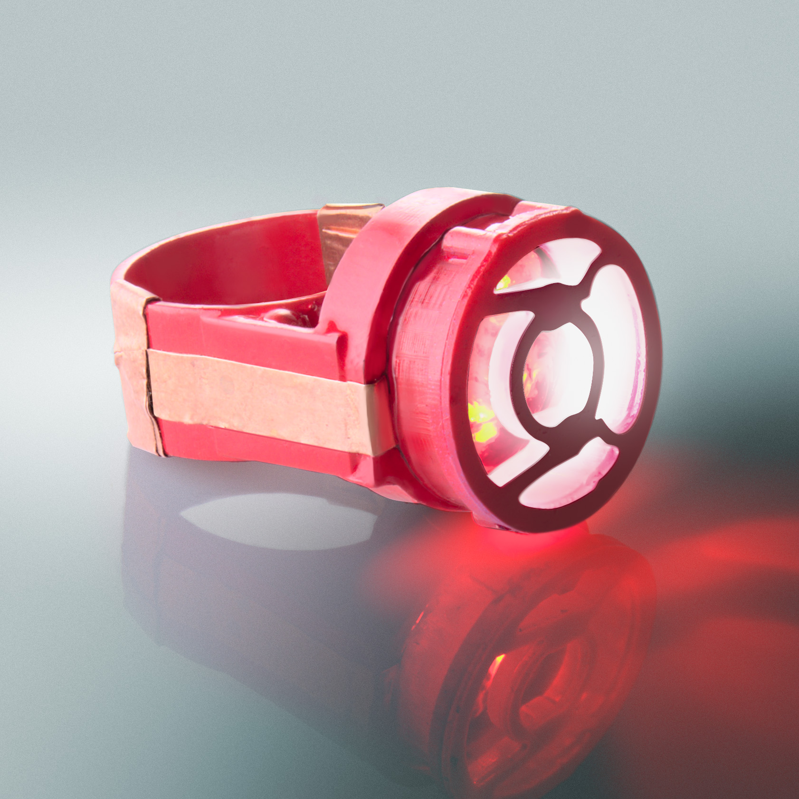
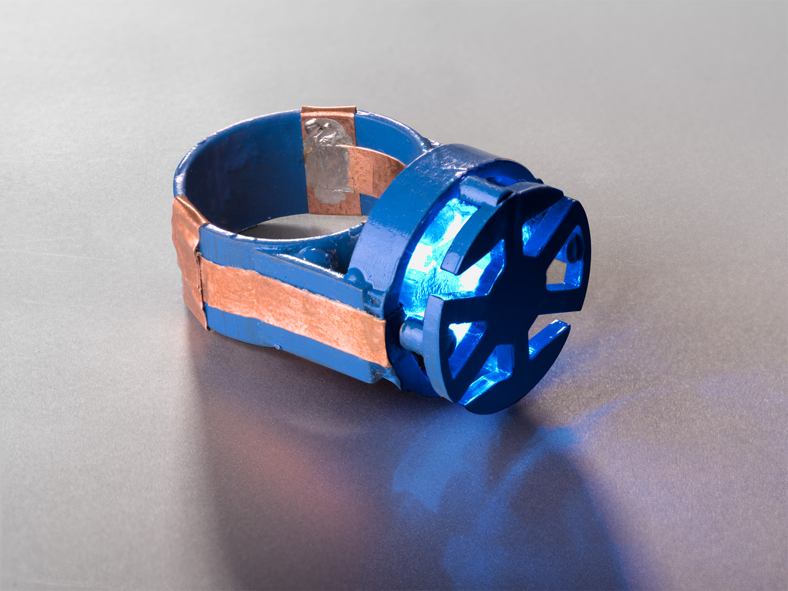

# Lantern Ring

**One ring to rule them all, in the light bind them**

## v2 physical hardware

[FreeCAD v2 twist-lock hardware](hardware/v2.0/ring_3d/README.md) provides a keyed
30-degree bayonet PCB/battery cassette, opposite-face CR2032 pogo contacts,
one insulated ground lead and screw-retained battery access. The compact crown
is 24.9 mm across, with the original 11 mm band width at the crest and a **rounded open-bottom
elastic band**. Hollow 40-degree conical shoulder walls brace the crown onto the
band, as the legacy side plates did. The shank tapers to 6 mm at the open tips
with comfort-fit rounded edges, using 2.5% less material than the unbraced band. The crown nests onto the finger arc; its LED-inclusive profile
is **11.42 mm above the finger**. A
[same-scale legacy comparison](hardware/v2.0/ring_3d/generated/legacy-comparison.png)
documents the remaining height/diameter difference. Native FreeCAD, STEP
and printable STL files are included with parametric regeneration scripts.
Battery replacement needs no soldering; the direct positive pogo and ground
lead still need three permanent joints. This is an unprinted, electrically unqualified prototype for the
mono-colour PCB, not a certified battery-powered product.
The [elastic-fit study](hardware/v2.0/ring_3d/generated/flex-fit.png) illustrates
a 1 mm expansion target, not a qualified size range; PA12 spring-back, creep
and comfortable fit still require physical testing.

### v2 CAD renders

Generated by `hardware/v2.0/ring_3d/build.ps1` from the parametric FreeCAD model.

| Assembled: low crown, braced open tapered band | Exploded: bayonet cassette and pogo stack |
| --- | --- |
|  |  |

| Same-scale legacy comparison | Open-band elastic-fit screen (unqualified) |
| --- | --- |
|  |  |

[Repository baseline review](docs/design/repository-review.md) distinguishes the
existing board variants and unfinished experiments.

[Contact and metal-body roadmap](docs/design/contact-roadmap/README.md) explores
copper-tape pressure contacts, replaceable plated springs and an electrically
isolated metal shell, with progressive local renders and prepared Nano Banana
prompts. These concepts do not replace the current manufacturing CAD.

[IR ring programming clip](hardware/v2.0/ring_ir_prog_clip/README.md) is a
solder-free pogo-pin ISP clip for the ATtiny85 `ring_pcb_IR`. It is a probe,
anvil and fence PCB set for an Adafruit 5434-style hinged clip kit. Its pin
spacing comes from the IR board's rear test pads, and it has a standard AVR
ISP-6 header. It passes KiCad ERC/DRC but has not yet been built or measured.
| 1. Serviceable pogo | 2. Copper pressure | 3. Plated springs | 4. Floating metal |
| --- | --- | --- | --- |
|  |  |  |  |

Available on :
- [Tindie](https://www.tindie.com/products/whatnick/lantern-rings/)
- [Etsy](https://www.etsy.com/au/listing/1365896916/lantern-corps-cosplay-ring-with)
- [PCBWay]
- [OSHPark]
- [Aisler](https://aisler.net/p/UOBXJDJP)
- [Shapeway](https://www.shapeways.com/shops/whatnick)
  - [Ring body](https://www.shapeways.com/product/PLQWLUV6V/lantern-ring-body?optionId=251926151&li=shop-inventory)
  - [Green Lantern Logo](https://www.shapeways.com/product/PLQWLUV6V/lantern-ring-body?optionId=251926155&li=shop-inventory)
  - [Yellow Lantern Logo](https://www.shapeways.com/product/87AK6SYQN/yellow-fear-lanterns-logo-from-dc-universe?optionId=253809626&li=shops)
  - [Blue Lantern Logo](https://www.shapeways.com/product/LDGX3RYWW/hope-lanterns-logo-from-dc-universe?optionId=253809602&li=shops)
  - [Indigo Lantern Logo](https://www.shapeways.com/product/RX6YYCM8E/indigo-empathy-logo-from-dc-universe?optionId=253810127&li=shops)
  - [Violet Lantern Logo](https://www.shapeways.com/product/Q4ZM3RG58/purple-love-lanterns-logo?optionId=253810197&li=shops)
  - [Red Lantern Logo](https://www.shapeways.com/product/2T2WC596J/red-rage-lanterns-logo?optionId=253810042&li=shops)
  - [Orange Lantern Logo](https://www.shapeways.com/product/XHF33N3QN/orange-avarice-lanterns-logo?optionId=253810121&li=shops)
  - [Black Lantern Logo](https://www.shapeways.com/product/NEF64B7SB/lantern-ring-life-and-death)
  - [White Lantern Logo](https://www.shapeways.com/product/NEF64B7SB/lantern-ring-life-and-death)
  - [Black MTG Logo](https://www.shapeways.com/product/NJ25J3LPM/magic-the-gathering-black-mana-logo?optionId=253809132)

[LED Colours and quantum physics](https://www.forbes.com/sites/chadorzel/2019/07/01/the-mostly-quantum-physics-of-making-colors/?sh=2ce5846e3953) are inextricably linked.
After watching a temperature based LED colour changing demo at questacon, an idea started forming in my head for using a similar idea with LED's of different colours and seeing how they
react spectrally with temperature.

I have also always been a Green Lantern nerd and I have been making lantern rings since 2010. You will probably find some of them in the wild in Hobart among the clientele of various
pubs and nightclubs. This is a more serious attempt at making a piece of electronic jewellery, cosplay prop and nerdy onanism all rolled into one.

## Licence

[OSHW TAPR](https://tapr.org/the-tapr-open-hardware-license/)
