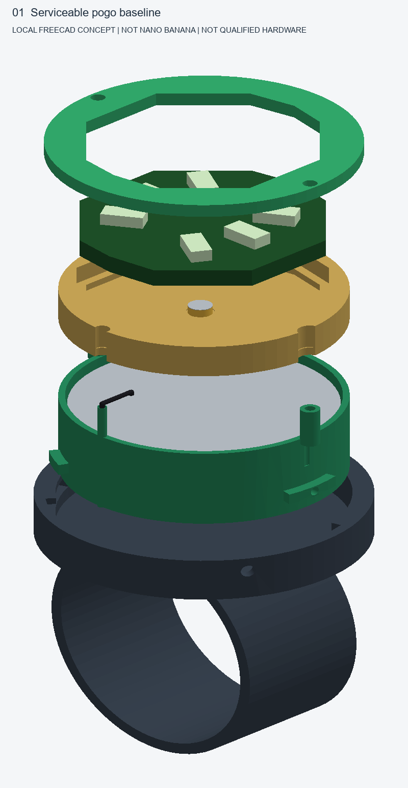
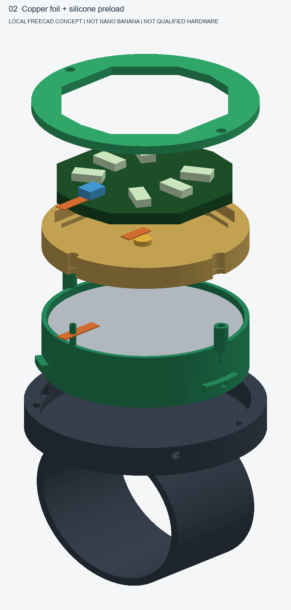
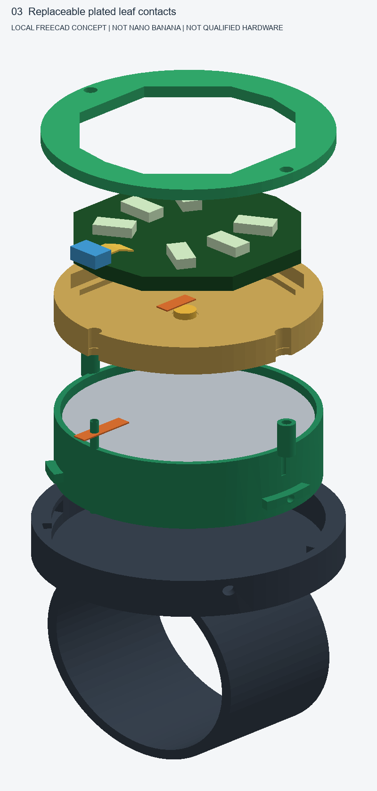
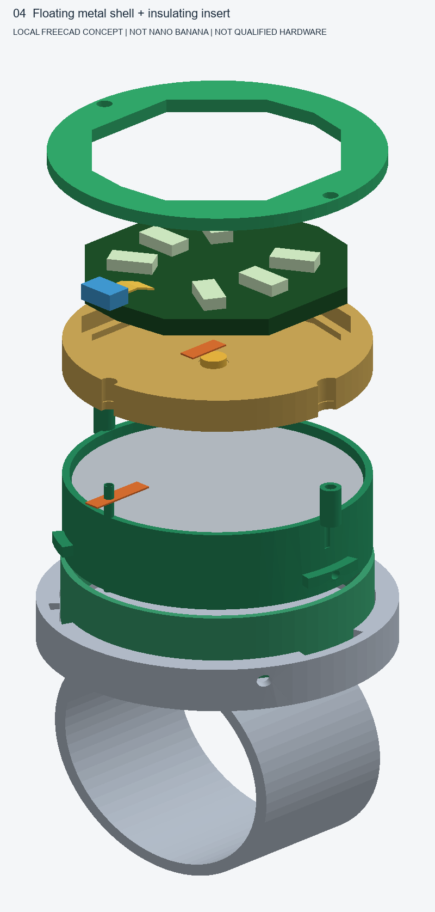
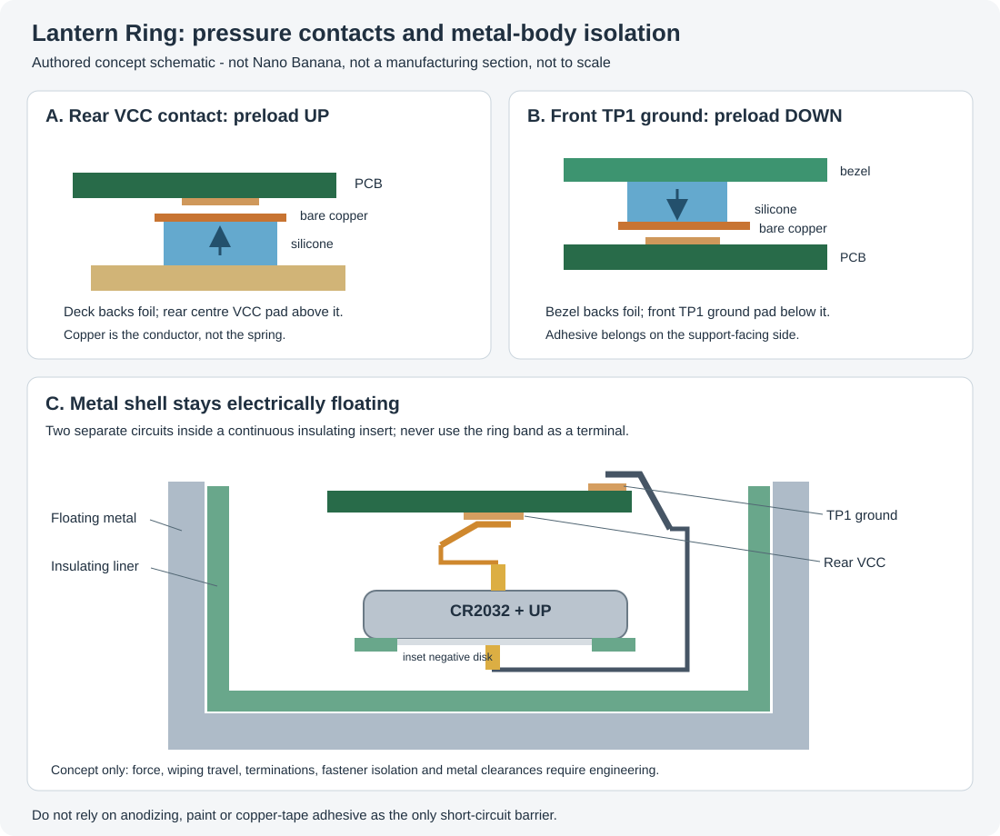

# Contact and metal-body design roadmap

**Status: ideation, not a revised manufacturing release.** The illustrations
now reference the [compact v2 CAD](../../../hardware/v2.0/ring_3d/README.md):
24.9 mm socket, 23.4 mm bezel, 11 mm band, short 0965 SMT pogo pins and a direct
rear-VCC solder connection. They do not reinstate the oversized 36.4 mm crown.
This roadmap explores eliminating the permanent PCB connections while
retaining opposite-face CR2032 pogo contacts and the removable bayonet cassette.
An outer ring body can be metal; the battery/contact insert still needs insulation.

**Nano Banana generation is blocked:** Gemini CLI is installed, but its
headless authentication check returned code 41 (no configured authentication),
and no image API key is available. No Nano Banana images have been generated.
The four renders below were generated **locally with FreeCAD**. They are
explicitly labelled alternatives, not evidence that Nano Banana ran.
Five reproducible Nano Banana prompts and an API client with offline
request/response tests are included for an authenticated run later. Live API
access remains unverified.

## Progressive concepts

| Stage | Contact idea | Evidence currently available | Next gate |
| --- | --- | --- | --- |
| 01 | Existing wire loom plus battery pogo pins | Existing native CAD, local exploded illustration | Print/bench qualify the baseline |
| 02 | Copper foil lands, silicone preload, mechanically captured terminations | Local concept overlay and authored contact section | Separate pad-contact coupons and short-circuit checks |
| 03 | Replaceable plated leaf-contact cartridge | Local concept overlay | Engineer force, stops, wiping motion, plating and fatigue |
| 04 | Metal band/socket with floating shell and insulated cassette | Local material/liner concept overlay | Design actual metal process, insulation and isolated fasteners |
| 05 | Contact-path and isolation section | Authored schematic; Nano Banana section prompt prepared | Verify both electrical paths and every possible short path |

### 01 - Serviceable baseline



This is the control design: the PCB rides in a profiled contact deck; a wide-key
three-lug cassette turns 30 degrees counterclockwise and is retained with an
anti-unlock screw. Two battery pogo pins connect through a soldered insulated
ground lead, with the positive pin base soldered directly to rear VCC. Battery
changes need no soldering. The exploded picture is explanatory,
not the literal removal sequence: remove bezel/PCB/deck before lifting the cell.

### 02 - Copper tape and compression pads



Orange lands illustrate copper foil; blue blocks illustrate compliant backing.
Two **separate** PCB contacts replace the PCB wire joints:

- Rear central **VCC**: a copper land faces upward under the exposed pad, with
  compliant backing supported by the insulating deck.
- Front **TP1 `/GND`**: a separate foil land faces downward onto the edge pad,
  with compliant backing supported by the bezel and an insulated perimeter route.

The retaining stack supplies controlled normal pressure. A small seating wipe
may help contact cleanliness; friction alone is not the retention or preload
mechanism. Copper foil is not a spring, and the adhesive side must not be the
pad-contact face. Conductive adhesive at an overlap is not an assumed durable
joint. Capture each continuous strip mechanically, protect cut edges, prevent
foil lift/creep, and keep it away from LEDs and unrelated exposed copper.

The silicone thickness, compression, compression set and final force are **not
specified yet**. The small pad footprint limits contact-placement tolerance.
Prototype removable coupons against the actual board finish before cutting new
carrier tooling. Bare copper oxide, sweat and repeated sliding are reasons to
treat tape as an experiment, not the final wearable contact material.

The conductor-to-pogo interface must also be solved: a captive clamp/spring
socket would replace the SMT base solder joint, but loose tape touching a
pin base is not an acceptable terminal. Four pressure/clamp interfaces are
not automatically more reliable than four permanent solder joints.

### 03 - Replaceable plated spring contacts



Gold-coloured leaf profiles replace the tape contact lands; blue blocks show
mechanical root capture. Separate phosphor-bronze contacts can provide their own
elastic preload, with rounded contact points, designed travel and overtravel
stops. Keep the VCC and ground leaves distinct and provide a replaceable
insulating cartridge rather than springing the PCB itself.

Select alloy temper, thickness, root radius, plating and force against the actual
PCB pad finish. A plated contact rubbing an unsuitable pad finish can still wear
through or become intermittent; "gold coloured" in a render is not a plating
specification. The existing KiCad pads have not been enlarged or changed to hard
gold contact lands. Decide whether a future PCB revision needs larger, same-side
power/ground contact lands before claiming a universal drop-in interface.

### 04 - Metal body, insulated electrical module



The silver shell represents stainless steel or titanium as possible structural/
decorative materials, not selected machining or casting specifications. The
green sleeve shows the intention to keep the electronic cassette isolated.
The contact leaves themselves are conductive metal; they remain separate from
the worn shell.

**Do not manufacture the current polymer RingBase STEP in metal as a direct
material swap.** The local illustration reuses the silhouette and adds a liner
overlay; that liner is not fitted into a redesigned bayonet clearance stack.
Wall thickness, tool access, undercut tracks, fastener threads, finish, mass and
liner retention all need a metal-specific CAD revision.

| Metal configuration | Decision |
| --- | --- |
| Floating metal band/socket + continuous polymer liner + two independent contacts | Preferred development direction: metal carries mechanical loads, not battery current |
| Metal body used as ground return | Deferred research option, not implemented: one conductor may be saved, but positive-cell-case contact, sweat, galvanic corrosion, skin exposure and fault paths become harder to control |
| One-piece metal body used for both poles | Not possible without electrically separated conductive regions; do not bridge VCC and ground |

A metal-body design must include:

- Continuous electrical isolation around the battery **positive case/rim**,
  negative contact, both PCB contacts, PCB edges and every termination.
- Insulating sleeves/washers where screws could reach circuitry, with retained
  insulation that cannot shift when the cassette is serviced.
- A raised insulating rim and clearances that survive wear, impact, debris and
  sweat. Paint, anodizing and tape adhesive are not the sole insulation barrier.
- Accessible contact cartridges, anti-unlock retention, deburred skin-facing
  surfaces and a process/finish appropriate for skin contact.

No minimum clearance, liner thickness, metal alloy or skin compatibility is
qualified here. If metal is intentionally connected to a net in a later study,
document that choice explicitly and reassess every short/fault path; do not
silently treat a conductive shell as "ground".

### 05 - Contact topology and insulation



This schematic is manually authored, not an AI image or a dimensioned CAD
section. It shows the **opposite preload directions** needed by the existing
board: upward onto rear VCC, downward onto front TP1 ground. The illustrative
leaf/foil shapes in the local exploded renders have intentional visual gaps;
they are not assembled contact-force or continuity simulations. Some path
segments are omitted to keep the images readable. **The schematic and written
net map, not the visual proximity of surfaces, define the intended circuits.**

## Nano Banana generation, provenance and review

`prompts.json` describes all five stages in a consistent industrial-design
style. The default is Nano Banana 2, `gemini-3.1-flash-image-preview`, as listed
by the [official extension](https://github.com/gemini-cli-extensions/nanobanana).
The supplied client calls the
[Gemini image API](https://ai.google.dev/gemini-api/docs/image-generation)
directly, avoiding a persistent extension installation and avoiding transmission
of repository source, credentials, CAD or private files.

From the repository root:

```powershell
python docs\design\contact-roadmap\generate_nano_banana.py --dry-run
# Set NANOBANANA_API_KEY securely in your environment; do not paste it into a tracked file.
python docs\design\contact-roadmap\generate_nano_banana.py
# For a later iteration, use a fresh directory rather than overwriting reviewed images:
python docs\design\contact-roadmap\generate_nano_banana.py --stage 04-floating-metal --output docs\design\contact-roadmap\images\nano-banana-metal-iteration-2
```

Only the authored text prompts are sent. Calls may incur provider charges.
The script accepts `NANOBANANA_API_KEY` and the documented Gemini/Google fallback
key variables; it never prints keys or commits them. A supported API model,
authentication and quota are required. Auth/network/no-image failures are
explicit. A partial failed run has no successful manifest; use a fresh output
directory for a retry.

Generated PNGs go to `images/nano-banana` with `manifest.json` containing
model, prompt hashes, image hashes and timestamp. **That directory does not
exist yet.** After a successful run, review each image against the constraints
below before embedding it here and committing the new manifest. API output can
invent electrically wrong or impossible geometry.

Reject an image if it shows VCC and ground touching, a ground contact on the
positive cell rim, the bare PCB twisting, an energized skin-contacting shell,
one conductor serving both poles, or pressure contacts with no preload support.
Correct images that hide the insulating liner, fastener barriers or service
access. Do not use AI imagery to select dimensions or prove compliance.

Rebuild the local substitutes with FreeCAD's bundled Python:

```powershell
& 'C:\Program Files\FreeCAD 0.19\bin\python.exe' docs\design\contact-roadmap\render_concepts.py
python -m unittest discover -s docs\design\contact-roadmap -p "test_roadmap.py"
```

Local image provenance is in `images/local-freecad/manifest.json`. No alternative
manufacturing STL, STEP or FCStd is generated by this roadmap script.

## Prototype gates before promoting any concept into v2 CAD

1. Use separate contact coupons to measure preload, assembly tolerance and
   serviceability. Establish suitable contact-force limits without bending PCB
   edges or overstressing silicone/leaves; do not copy the battery pogo's force
   specification onto PCB leaf contacts.
2. With no cell fitted, verify each intended contact path and isolation between
   VCC, ground and the floating shell. Check terminal clamps, screw paths and
   contact motion through the complete service/lock range.
3. With a current-limited source and representative load, measure voltage drop
   and interruptions while twisting, tapping and moving the assembly. Define
   resistance and transient limits from the LED circuit budget before testing.
4. Trial repeated insertion, battery replacement, contamination/sweat exposure,
   foil/adhesive creep, leaf fatigue, liner wear, drop and accidental countertwist.
   Recheck isolation and loaded contact performance after each exposure.
5. Resolve the mono board's current-limiting and reverse-insertion risks before
   wearable use. Never solder to or charge a primary CR2032. Screw retention is
   not a claim of battery-compartment certification; keep this adult prototype
   away from children.

Once those gates pass, update parameterised engineering CAD, PCB contact lands
if needed, contact BOM and assembly instructions, and run the native/STEP/STL
and motion checks again. Until then the shipped v2 CAD remains the baseline.
