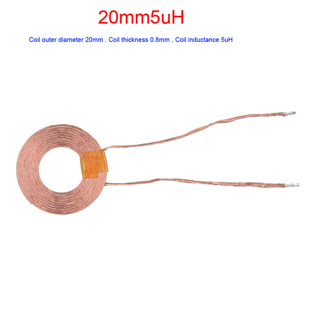

# QI Charger in ring design

Reference [prior art](https://github.com/olliiiver/kicad_qi)

## Main Components
The following main components are proposed
- Texas Instruments [BQ51003](https://www.ti.com/lit/ds/symlink/bq51003.pdf?ts=1667101441728)
- Texas Instruments [BQ51013B](https://www.ti.com/product/BQ51013B)
- Air core transformer [secondary coil](https://www.aliexpress.com/item/1005004150745110.html)

- Off the shelf [receiver](https://www.aliexpress.com/item/1005002341447996.html)