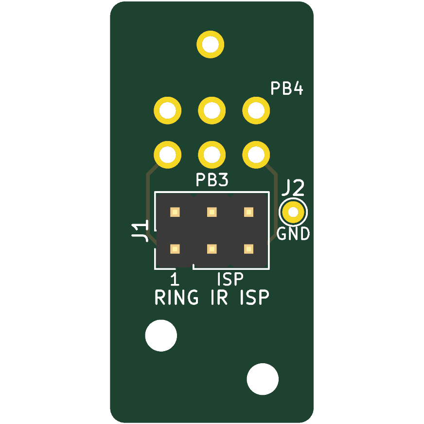
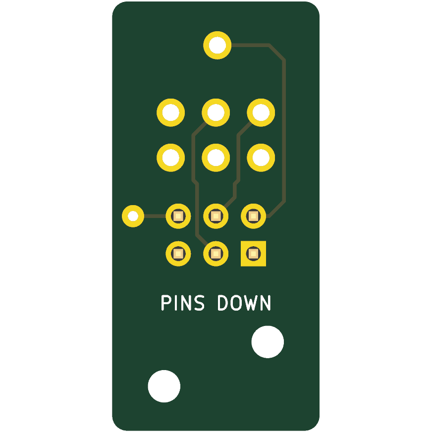
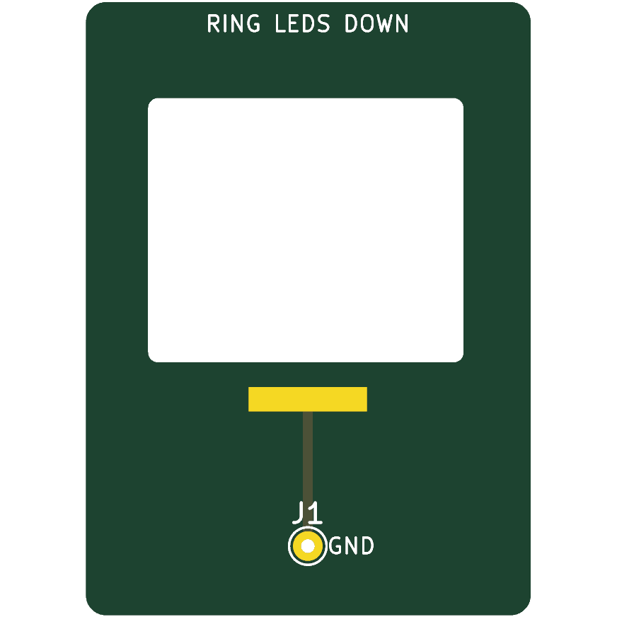
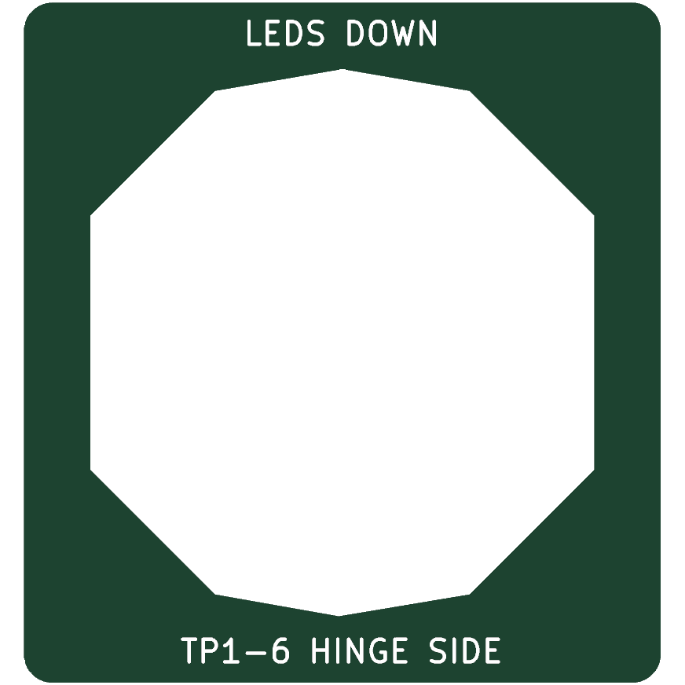

# Ring IR programming clip

A solder-free in-system programming (ISP) clip for the
[`ring_pcb_IR`](../ring_pcb_IR) ATtiny85 board. Spring-loaded pogo pins press on
the board's rear test pads, held by a hinged clip like
[Adafruit 5434](https://www.adafruit.com/product/5434) but with pin spacing
matched to the ring. The parts are the jaws, spring and hardware from the
[AliExpress DIY pogo clip kit](https://www.aliexpress.com/item/1005006153573416.html),
with its generic guide PCBs replaced by the boards here.

> **Status: generated and checked in KiCad only.** ERC and DRC pass with zero
> violations of any severity. The clip has not been built or fitted, and it has
> not programmed a ring. The kit mounting holes and pogo-pin dimensions are
> unmeasured placeholders (`"measured": false` in `parameters.json`).

| Probe (pin side up, two stacked) | Probe (ring side) | Anvil (lower jaw) | Fence (locator) |
| --- | --- | --- | --- |
|  |  |  |  |

## How it works

All components on the ring are on the front, so the rear is flat. The ring
goes into the clip **LEDs down**:

```
   upper jaw ─┐  probe PCB x2 (stacked guide pair, pogo pins pointing down)
              │   ││ ││ ││   ← 7 pins on TP1–TP6 + TP9 (VCC)
              ▼   ▼▼ ▼▼ ▼▼
        ═══════ ring_pcb_IR (rear up, LEDs down) ═══════
        ─fence─[  pocket locates the ring outline  ]─fence─
        ─anvil─[ window clears LEDs/IC ]▄▄ GND pad ─anvil─
   lower jaw ─┘                        ▲ presses the front GND bar (TP8)
```

- **Probe board** (about 14 × 29 mm). Order two identical boards and stack them
  about 5–8 mm apart, as the kit's guide pair does. Seven P75-class pins are
  mirrored onto TP1–TP6 (3.05 mm grid) and TP9. TP9 is the VCC test point at
  the centre of the exposed battery pad. The pins are routed to a standard
  AVR ISP-6 header (J1) and a GND lead pad (J2).
- **Anvil board** (about 22.5 × 31 mm). Taped to the lower jaw. A window
  clears every front courtyard. The ring rests on its side rails, the top band
  and a flat ENIG GND pad under the exposed front ground bar (TP8). A tail pad
  (J1) takes the GND lead.
- **Fence board** (about 22.5 × 24 mm). Stacked on the anvil. Its pocket is the
  ring outline plus 0.15 mm, so the ring drops in at a fixed position.
- **GND lead.** A short 30 AWG wire runs from probe J2 to anvil J1. GND is only
  on the ring's front, so it cannot be reached from the pogo side.

The geometry comes from `ring_pcb_IR.kicad_pcb`, not hand-entered:
pad positions, nets, outline, the front mask opening and courtyards. The
generator stops if a target net, layer or the 3.05 mm grid changes.

### Pin map

| Ring pad | Net | ATtiny85 function | ISP-6 pin |
| --- | --- | --- | --- |
| TP1 | PB0 | MOSI | 4 |
| TP2 | PB1 | MISO | 1 |
| TP3 | PB2 | SCK | 3 |
| TP6 | PB5 | RESET | 5 |
| TP9 | VCC | VCC | 2 |
| TP8 (front bar, via anvil) | GND | GND | 6 |
| TP4, TP5 | PB3, PB4 | spare GPIO (MCU and test pad only) | not routed; probe at the pin tops or omit the pins |

ISP-6 is the standard Atmel 2×3 2.54 mm layout (pin 1 MISO, 2 VCC, 3 SCK,
4 MOSI, 5 RESET, 6 GND), so USBasp, AVRISP mkII, Arduino-as-ISP and similar
programmers plug straight in. A ring inserted 180° the wrong way is harmless:
VCC still lands on the central pad, the signal pins land on solder mask, and
GND reaches the other bar.

## BOM

| Qty | Part | Notes |
| --- | --- | --- |
| 2 | Probe PCB, 1.6 mm | `fab/ring_ir_prog_probe.zip` |
| 1 | Anvil PCB, 1.6 mm, ENIG | `fab/ring_ir_prog_anvil.zip`; ENIG for the flat GND contact |
| 1 | Fence PCB, 1.6 mm | `fab/ring_ir_prog_fence.zip`; stack two for a deeper pocket if needed |
| 7 | P75-class pogo pin, 1.02 mm barrel | B1 spear or LM2 cone tip for bare 1 mm square pads; the kit's pins if they measure the same |
| 1 | 2×3 2.54 mm pin header | Through-hole, on the top probe board |
| 1 | DIY pogo clip kit | Jaws, spring and M2 screws/nuts |
| – | 30 AWG wire, VHB or double-sided tape | GND lead; holds the anvil/fence to the lower jaw |

## Before ordering: measure first

1. Measure the kit's guide-PCB mounting holes and jaw outline. Update
   `clip_kit.mount_holes_uv`, then set `clip_kit.measured` to `true`.
2. Measure the pogo pins: barrel diameter, length, travel and tip. Update
   `pogo.*`, keeping `drill` about 0.1–0.15 mm larger than the barrel, then set
   `pogo.measured` to `true`.
3. Regenerate and confirm the stacked probe boards fit the jaw. The pins should
   reach the ring at about two-thirds of their travel when the clip is closed.

## Assembly

1. Push the pins through both stacked probe boards with equal protrusion. Solder
   them on the top board only, so the lower board stays a sliding guide. Solder
   J1 and the GND lead to J2.
2. Screw the probe stack to the upper jaw.
3. Close the clip on a ring, then set the pin height so the pins sit at about
   two-thirds of their travel.
4. Tape the fence onto the anvil and solder the other end of the GND lead to
   anvil J1. Place the stack loosely on the lower jaw.
5. Insert a ring LEDs down and close the clip. Nudge the anvil stack until
   `avrdude -c usbasp -p t85` reads the signature (`0x1e930b`) every time, then
   tape it down.

## Safety

- **Remove the CR2032 before programming.** The programmer's VCC drives the
  ring's VCC directly, and backfeeding a primary lithium cell is unsafe.
- Use a 3.3 V or 5 V programmer within the ATtiny85 and LED limits, and keep
  current limited.
- Always insert LEDs down. Face-up insertion lets pins hit components.

## Regenerate

Requires KiCad 10 (Windows paths shown):

```powershell
& hardware\v2.0\ring_ir_prog_clip\build.ps1 -Fab
python -m unittest discover -s hardware\v2.0\ring_ir_prog_clip -p test_prog_clip.py
```

`build.ps1` does the following:

1. Runs `generate.py` with KiCad's Python.
2. Upgrades the schematics and runs ERC and DRC with schematic parity.
3. Exports PDFs, PNG renders and STEP.
4. With `-Fab`, exports Gerbers and Excellon drill files into `fab/`.
5. Runs `check_reports.py`, which fails on any violation and writes
   `generated/validation.json` with source hashes.

The portable unit test parses the KiCad files directly, without `pcbnew`. It
checks the following:

- pogo positions and nets against the target board;
- the ISP-6 pinout;
- the anvil GND pad sits inside the exposed GND bar;
- the window clears every front courtyard;
- the pocket clearance;
- the provenance hashes.

Do not hand-edit the generated `.kicad_pcb`, `.kicad_sch` or `fab/` files.
Change `parameters.json` or `generate.py` and rebuild.
