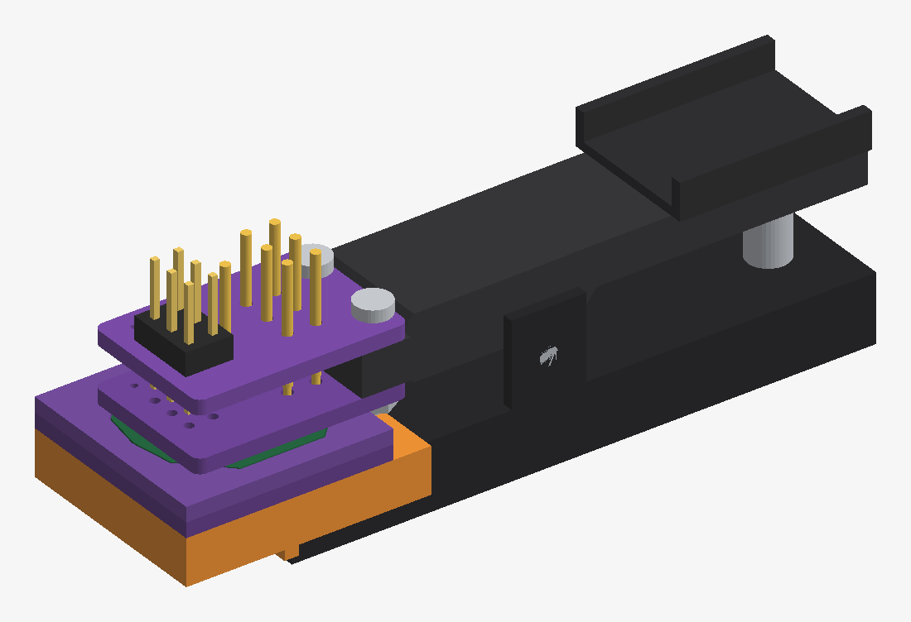
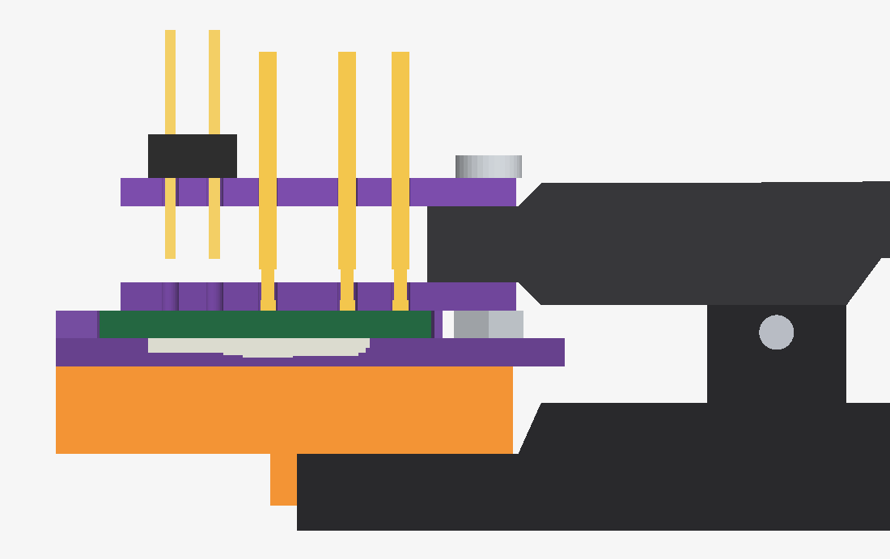
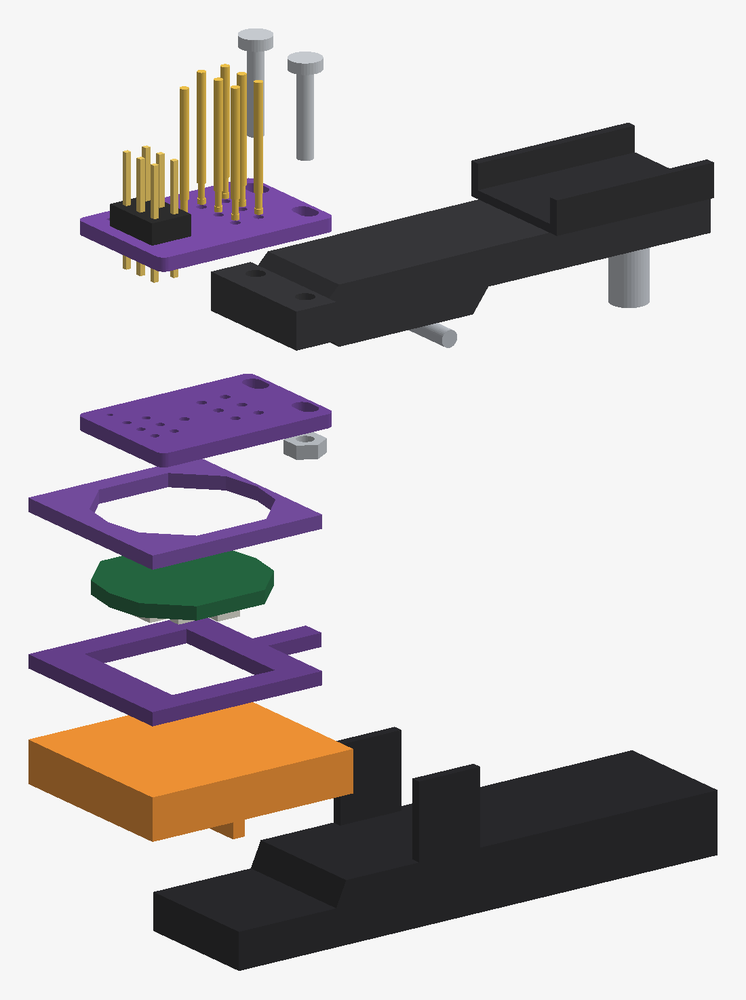

# Ring IR programming clip

A solder-free in-system programming (ISP) clip for the
[`ring_pcb_IR`](../ring_pcb_IR) ATtiny85 board. Spring-loaded pogo pins press on
the board's rear test pads, held by a hinged clip like
[Adafruit 5434](https://www.adafruit.com/product/5434) but with pin spacing
matched to the ring. The parts are the jaws, spring and hardware from the
[AliExpress DIY pogo clip kit](https://www.aliexpress.com/item/1005006153573416.html),
with its generic guide PCBs replaced by the boards here.

> **Status: generated, checked in KiCad, and fitted virtually in FreeCAD.**
> ERC and DRC pass with zero violations of any severity. The FreeCAD fit check
> passes against a clip model built from **photo and datasheet estimates**,
> because the seller publishes no drawing. The clip has not been built or
> physically fitted, and it has not programmed a ring. The clip dimensions and
> pogo-pin dimensions are unmeasured.



| Probe (pin side up, two stacked) | Probe (ring side) | Anvil (lower jaw) | Fence (locator) |
| --- | --- | --- | --- |
|  |  |  |  |

## How it works

All components on the ring are on the front, so the rear is flat. The ring
goes into the clip **LEDs down**:

```
  header  pins           probe PCB (on top of the upper-jaw tip)
  ┌┴┐  ││ ││ ││ ┌───────┐ ← M2 screw through the jaw holes and both slots
 ═╧═╧══╪╪═╪╪═╪╪═│ upper │══  probe
       ││ ││ ││ │  jaw  │
 ══════╪╪═╪╪═╪╪═└───────┘══  guide (second probe board, unpopulated)
 ══════ ring_pcb_IR (rear up, LEDs down) ═══╗ ← pins land on TP1–TP6 + TP9
 ─fence─[ pocket locates the ring ]─fence─  ║ nut
 ─anvil─[ window clears parts ]▄ GND pad ─anvil──── tail (GND lead)
 ▓▓▓▓▓▓▓▓▓ printed riser (5 mm) ▓▓▓▓▓▓▓▓▓▓▓▓
         ▓ hook ┌──────── lower jaw ─────────
```

- **Probe board** (15.5 × 22.7 mm, the jaw width). Order two identical boards.
  They sandwich the upper-jaw tip, as on Adafruit 5434: the populated probe on
  top, the unpopulated copy underneath as a pin guide resting on the ring. Two
  M2 slots go through both boards and the jaw holes; the slots absorb the
  unmeasured hole spacing (7.8–10.2 mm). Seven P75-class pins are mirrored onto
  TP1–TP6 (3.05 mm grid) and TP9. TP9 is the VCC test point at the centre of
  the exposed battery pad. The pins are routed to a standard AVR ISP-6 header
  (J1) and a GND lead pad (J2). The header sits **in front of** the pin grid,
  so the jaw tip can sit just behind the pins and close over the ring.
- **Anvil board** (22.5 × 29.2 mm). Taped to the printed riser. A window
  clears every front courtyard. The ring rests on its side rails, the top band
  and a flat ENIG GND pad under the exposed front ground bar (TP8). A narrow
  tail pad (J1) takes the GND lead between the M2 nuts.
- **Fence board** (22.5 × 22.2 mm). Stacked on the anvil. Its pocket is the
  ring outline plus 0.15 mm, so the ring drops in at a fixed position. Its
  rear edge stops 0.6 mm past the ring so the M2 nuts clear it.
- **Riser** (printed). Lifts the anvil 5.0 mm, so
  the stack matches the 9.8 mm parallel jaw gap and the jaws close parallel.
  A hook drops in front of the lower-jaw tip to stop the stack sliding.
- **GND lead.** A short 30 AWG wire runs from probe J2 to anvil J1. GND is only
  on the ring's front, so it cannot be reached from the pogo side.

The probe layout matches the IR board's test-pad positions, electrical nets,
outline and component clearances. See [development.md](development.md) for
engineering source and regeneration details.

### Pin map

| Ring pad | Net | ATtiny85 function | ISP-6 pin |
| --- | --- | --- | --- |
| TP1 | PB0 | MOSI | 4 |
| TP2 | PB1 | MISO | 1 |
| TP3 | PB2 | SCK | 3 |
| TP6 | PB5 | RESET | 5 |
| TP9 | VCC | VCC | 2 |
| TP8 (front bar, via anvil) | GND | GND | 6 |
| TP4, TP5 | PB3, PB4 | spare GPIO (MCU and test pad only) | not routed; probe at the pin tops or omit the pins |

ISP-6 is the standard Atmel 2×3 2.54 mm layout (pin 1 MISO, 2 VCC, 3 SCK,
4 MOSI, 5 RESET, 6 GND), so USBasp, AVRISP mkII, Arduino-as-ISP and similar
programmers plug straight in. A ring inserted 180° the wrong way is harmless:
VCC still lands on the central pad, the signal pins land on solder mask, and
GND reaches the other bar.

## Clip dimensions (estimated)

The AliExpress listing has photos only. Dimensions come from the Adafruit 5434
datasheet (`C17220-001`, same clip family) and from its photos scaled by a US
quarter and the 2.54 mm header pitch. The two scales agree within about 3%.
The estimates carry ±1.0 mm uncertainty. Frame: x from the lower-jaw tip
toward the hinge; heights from the lower-jaw top.

| Dimension | Estimate | Source |
| --- | --- | --- |
| Overall length | 62.5 mm | Datasheet p8 drawing |
| Jaw width | 15.5 mm | Front photo, header-pitch scale |
| Lower jaw: tip thickness / tip length / throat thickness | 4.4 / 12.7 / 7.3 mm | Side photo |
| Upper-jaw tip setback from lower tip | 7.5 mm | Side photo |
| Upper jaw: tip thickness / tip section end / mid thickness | 4.4 / 12.7 / 7.0 mm | Side photo |
| Parallel jaw gap at the tip (clamped) | 9.8 mm | Side photo, Adafruit stack clamped |
| Gap at the throat | 5.6 mm | Side photo |
| Hinge pin | x ≈ 27.5 mm (about 47% of length) | Side photo, AliExpress image 6 |
| M2 holes in the upper-jaw tip | 2 across the width, ≈ 9 mm apart, ≈ 3.5 mm behind the tip | AliExpress image 6, Adafruit photos |
| Spring / U-block | x ≈ 56.5 / 41.5–62 mm | Side photo (visual only) |
| P75 pin | 16.5 mm long, 1.02 mm barrel, 2.5 mm travel | Datasheet p13–14 |

## FreeCAD fit check

The virtual fit check builds a parametric assembly of the following parts:

- the clip jaws, hinge, spring and U-block;
- the riser;
- the anvil and fence;
- the ring with component height boxes;
- the guide and probe boards;
- seven pins at working compression;
- the header;
- the M2 screws and nuts.

It runs boolean interference checks on each part pair (33 pairs touch) and
checks contacts and clearances, then sweeps each clip estimate by ±1 mm.
Detailed fit-check information is in [development.md](development.md).

| Clamped (section at u = 0) | Exploded stack |
| --- | --- |
|  |  |

Results at the nominal estimates:

| Check | Result |
| --- | --- |
| Interference between any two parts | none |
| Contacts (riser–jaw, guide–ring, jaw–guide, probe–jaw, pins–ring) | all touching, 0.000 mm |
| Stack (riser / anvil / ring / guide / jaw / probe top) | 5.0 / 6.6 / 8.2 / 9.8 / 14.2 / 15.8 mm |
| Jaw tilt at the clamped gap | 0.0° (riser sized to the parallel gap) |
| Pin compression | 1.65 mm, 66% of 2.5 mm travel |
| Pin position against the TP pad centres | 0.000 mm |
| Pin barrel to upper-jaw tip | 1.04 mm |
| Probe end to the upper-jaw step | 0.10 mm |
| M2 nut to fence/anvil; screw tip above riser | 0.65 mm; 0.80 mm |
| Ring parts to riser (inside the anvil window) | 0.35 mm |
| Header tails above the guide | 1.35 mm |
| Ring rear edge to the lower-jaw throat | 4.95 mm |

The ±1 mm sweep shows which dimensions to measure first:

- **Hole setback +1 mm or upper-tip setback +1 mm.** The probe end reaches the
  upper-jaw step. With the setback +1 mm the barrel also nears the jaw tip.
- **Upper tip section 1 mm shorter.** Same probe-end conflict.
- **Lower tip 1 mm shorter.** The riser end reaches the throat ramp.

All other ±1 mm cases still pass. The VCC pin sits 1.6 mm in front of the
lower-jaw tip; the riser carries that load.

## BOM

| Qty | Part | Notes |
| --- | --- | --- |
| 2 | Probe PCB, 1.6 mm | `fab/ring_ir_prog_probe.zip`; top is populated, the second is the pin guide |
| 1 | Anvil PCB, 1.6 mm, ENIG | `fab/ring_ir_prog_anvil.zip`; ENIG for the flat GND contact |
| 1 | Fence PCB, 1.6 mm | `fab/ring_ir_prog_fence.zip`; stack two for a deeper pocket if needed |
| 7 | P75-class pogo pin, 1.02 mm barrel | B1 spear or LM2 cone tip (head ≤ 1.05 mm, so it passes the 1.15 mm guide hole) |
| 1 | 2×3 2.54 mm pin header | Through-hole, on the top probe board |
| 1 | DIY pogo clip kit | Jaws, spring, M2 nuts |
| 2 | M2 × 10 pan-head screw | The kit's 12–16 mm screws are longer than the 9.2 mm grip and hit the riser |
| 1 | Printed riser | PLA or PETG, 100% infill |
| – | 30 AWG wire, VHB or double-sided tape | GND lead; holds the anvil/fence to the riser and the riser to the lower jaw |

## Before ordering: measure first

1. Measure the jaw with calipers and update the design settings. Start with the
   dimensions the sweep flags: the hole setback, the upper-tip setback and tip
   section length, the lower-tip length, the hole spacing, and the parallel
   gap with the clip closed on a 9.8 mm stack.
2. Measure the pogo pins: barrel diameter, length, travel and tip. Update the
   design settings, keeping the drill about 0.1–0.15 mm larger than the barrel.
3. Rebuild. The FreeCAD fit and the sweep must pass. The pins should reach
   the ring at about two-thirds of their travel when the clip is closed.

## Assembly

1. Solder J1 and the GND lead to J2 on the top probe board.
2. Screw the probe (top) and guide (underneath) to the upper-jaw tip with
   M2 × 10 screws through the slots. Put the nuts under the guide.
3. Insert the pins tip first from the top, through the probe and the guide.
   Set them so the tips stand 1.65 mm below the guide. In the clamped stack
   that is 66% of travel, and the barrel ends 0.75 mm above the guide. Solder
   them on the top board only.
4. Tape the riser onto the lower jaw, with its hook against the jaw tip. Tape
   the anvil to the riser and the fence onto the anvil. Solder the other end
   of the GND lead to anvil J1.
5. Insert a ring LEDs down into the fence and close the clip. The guide comes
   down flat onto the ring and fence. Nudge the anvil stack until the programmer
   reads the ATtiny85 signature consistently, then tape it down.

## Safety

- **Remove the CR2032 before programming.** The programmer's VCC drives the
  ring's VCC directly, and backfeeding a primary lithium cell is unsafe.
- Use a 3.3 V or 5 V programmer within the ATtiny85 and LED limits, and keep
  current limited.
- Always insert LEDs down. Face-up insertion lets pins hit components.

## Development

KiCad/FreeCAD regeneration, validation and source-file details are in
[development.md](development.md).
